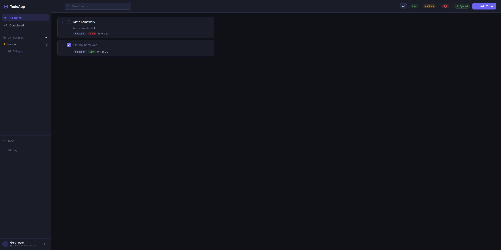

# TodoApp

> A full-stack, real-time todo application built as a portfolio demonstration.




---

## Features

- ✅ **Full authentication** — Register & login with JWT in httpOnly cookies
- ✅ **CRUD todos** — Create, edit, complete, and delete tasks
- ✅ **Categories** — Organize todos with color-coded categories
- ✅ **Tags** — Multi-tag todos for flexible organisation
- ✅ **Priorities** — Low / Medium / High with color badges
- ✅ **Due dates** — With overdue visual indicator
- ✅ **Drag-and-drop reorder** — Persistent order saved to DB
- ✅ **Real-time cross-tab sync** — Changes appear instantly in all open tabs via Socket.io
- ✅ **Live search & filters** — Filter by category, tag, priority, and completion
- ✅ **Premium dark UI** — Framer Motion animations, custom dark-mode design system

---

## Quick Start

### Prerequisites
- [Docker](https://docs.docker.com/get-docker/) & Docker Compose

### Run in one command

```bash
git clone <this-repo>
cd todo-app
docker compose up
```

Then open **http://localhost:5173** in your browser.

> On first run, Docker will pull images and install dependencies — allow ~2 minutes.

---

## Architecture

```
/todo-app
  /client          React 18 + Vite + Zustand + Framer Motion + dnd-kit
  /server          Express + Knex.js + Socket.io + bcrypt + JWT
  docker-compose   PostgreSQL 16 + server + client (all with hot-reload)
```

**Data flow:**
```
React (Zustand) ←──REST──→ Express API ←──Knex──→ PostgreSQL
                  ←──Socket.io──────────────────────────────
```

### Real-time sync
1. Any todo mutation hits the REST API
2. The server saves to DB and emits a Socket.io event to the user's private room
3. All open tabs receive the event and update their Zustand store

---

## Tech Stack

| Layer | Technology | Why |
|---|---|---|
| Frontend | React 18 + Vite | Fast builds, modern DX |
| State | Zustand | Lightweight, no boilerplate |
| Animations | Framer Motion | Premium feel with minimal code |
| Drag & Drop | @dnd-kit | Modern, accessible (RBD deprecated) |
| Backend | Express.js | Familiar, widely understood |
| Database | PostgreSQL | Relational, mature, industry-standard |
| DB client | Knex.js | SQL control + migrations |
| Auth | JWT + httpOnly cookies | XSS-safe token storage |
| Real-time | Socket.io | Battle-tested, easy to reason about |
| Infra | Docker Compose | One-command setup |

---

## API Reference

**Base URL:** `http://localhost:4000/api/v1`

| Method | Path | Description |
|---|---|---|
| POST | `/auth/register` | Create account |
| POST | `/auth/login` | Login, sets JWT cookie |
| POST | `/auth/logout` | Clear cookie |
| GET  | `/auth/me` | Current user |
| GET  | `/todos` | List todos (supports `?search=`, `?category=`, `?tag=`, `?priority=`, `?completed=`) |
| POST | `/todos` | Create todo |
| PATCH | `/todos/:id` | Update todo |
| DELETE | `/todos/:id` | Delete todo |
| PATCH | `/todos/reorder` | Bulk reorder |
| GET/POST/DELETE | `/categories` | Manage categories |
| GET/POST/DELETE | `/tags` | Manage tags |

---

## Database Schema

```
users ──< categories ──< todos >──< todo_tags >── tags
```

- `todos.order_index` — persists drag-and-drop order
- `todos.category_id` → `SET NULL` on category delete
- UUID primary keys throughout

---

## Local Development (without Docker)

```bash
# Terminal 1 — PostgreSQL (requires local pg or use Docker just for DB)
docker compose up postgres

# Terminal 2 — Server
cd server
cp ../.env.example .env   # edit DATABASE_URL if needed
npm install
npm run dev

# Terminal 3 — Client
cd client
npm install
npm run dev
```
